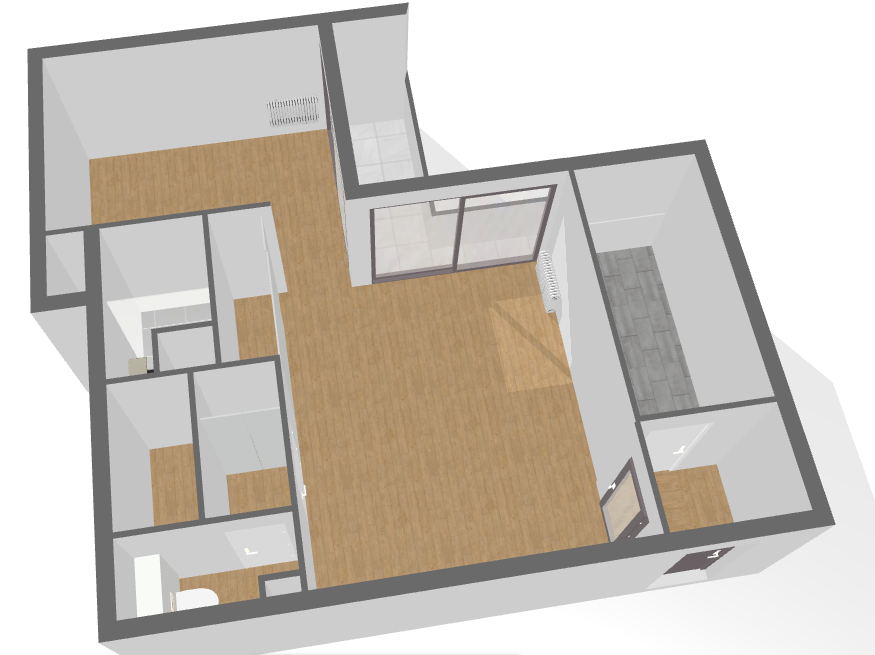
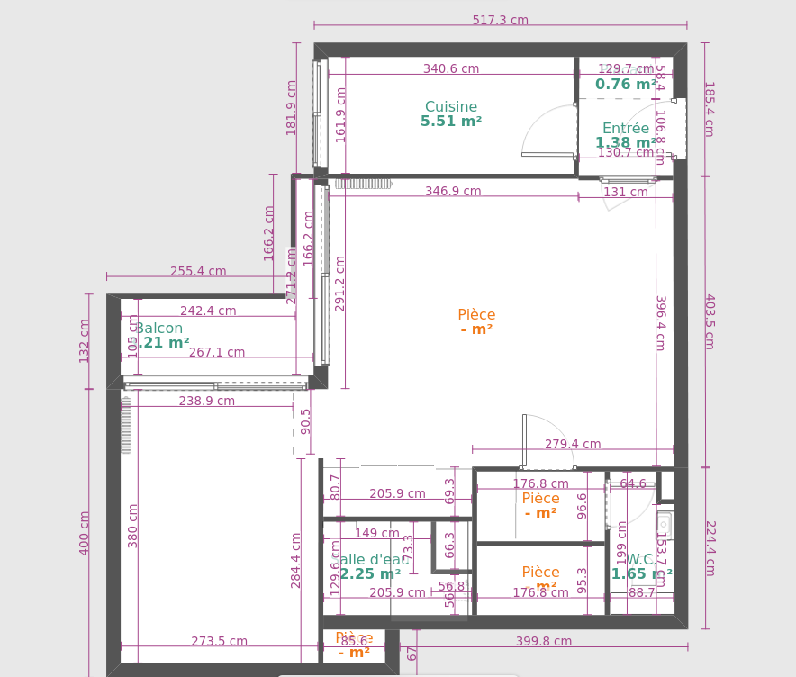

# Description

Au pied du métro Couronnes, grand 2 pièces de 43,5 m² avec balcon sans vis-à-vis.  
L'appartement est très lumineux et exposé plein sud au 6ème étage avec ascenceurs.  
Il se compose d'une entrée avec rangements, d'un séjour de 20 m2 , d'une cuisine indépendante, d'une chambre de 10 m2, d'une salle  d'eau, de WC indépendants, et d'un balcon de 3m². 
Eau chaude et chauffage collectif.  Charges annuelles 2400 euros.
Une cave saine complète ce bien. Possibilité d'acquérir en plus une grande place de parking.
Appartement en très bon état refait récemment (peintures, cuisine, sdb, volets électriques), fenêtres avec double vitrage et volets électriques.

### Prix 375 000 euros:
375 000 euros.
Vente de particuliers à particuliers, pas de frais d'agences.  
Pour information, un appartement identique a été vendu 385 000 euros au 8ème étage au mois de Juin 2022.  
([voir la fiche](plaza.pdf))

### Photos:
- [Salon](salon.md)
- [Chambre](chambre.md)
- [Balcon](balcon.md)
- [Cuisine](cuisine.md)
- [Salle de bain](sdb.md)
- [Sanitaires](wc.md)
- [Entrée](entree.md)

### Contact:  
Premier contact par mail uniquement: 25bvbelleville@gmail.com  

 
 